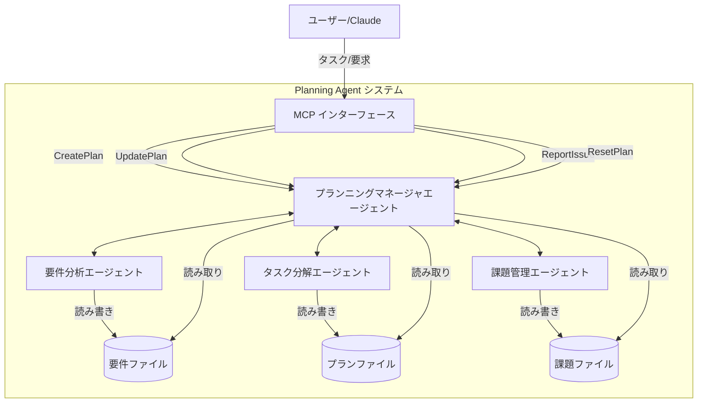
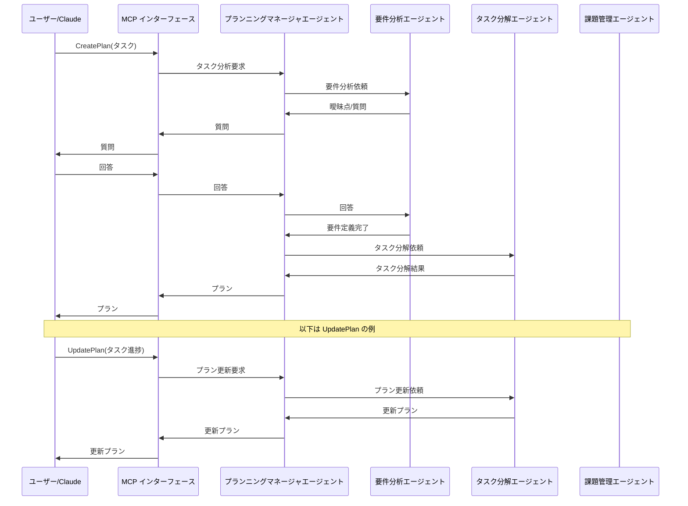

# Planning Agent システム Design Document

## 1. 概要

Planning Agentシステムは、マルチエージェントアーキテクチャを活用した外部プランニングエンジンを実装するものである。本ドキュメントでは、システムの具体的な実装方針と技術アーキテクチャを定義する。

## 2. システムアーキテクチャ

### 2.1 全体アーキテクチャ



### 2.2 データフロー



## 3. コンポーネント設計

### 3.1 ファイル構造

```
planning_agent/
├── config/
│   ├── agent_config.yaml      # エージェント設定
│   └── mcp_config.yaml        # MCP設定
├── agents/
│   ├── __init__.py
│   ├── planning_manager.py    # プランニングマネージャエージェント
│   ├── requirement_analyzer.py # 要件分析エージェント
│   ├── task_decomposer.py     # タスク分解エージェント
│   └── issue_manager.py       # 課題管理エージェント
├── mcp_interface/           # MCPサーバー関連
│   ├── __init__.py
│   └── server.py            # MCPサーバー実装 (FastMCP使用)
├── utils/
│   ├── __init__.py
│   ├── file_manager.py        # ファイル入出力機能
│   ├── tools.py               # smolagentsツール集
│   └── prompt_templates.py    # プロンプトテンプレート
├── cli.py                     # CLIインターフェース
└── main.py                    # メインエントリーポイント
```

### 3.2 データモデル

#### 3.2.1 要件ファイル (YAML)

```yaml
task_id: "task-001"
created_at: "2025-04-03T10:00:00Z"
title: "数独パズルを解く"
description: "9x9の数独パズルを解いてください"
clarifications:
  - question: "パズルの初期状態はどのように提供されますか？"
    answer: "文字列形式で提供します"
  - question: "解答のフォーマットはどうすべきですか？"
    answer: "同じ文字列形式で返してください"
constraints:
  - "各行、各列、各3x3ブロックには1から9までの数字が1つずつ入る"
  - "初期配置の数字は変更できない"
resources:
  - "数独の初期状態: '53..7....6..195....98....6.8...6...34..8.3..17...2...6.6....28....419..5....8..79'"
```

#### 3.2.2 プランファイル (YAML)

```yaml
plan_id: "plan-001"
task_id: "task-001"
created_at: "2025-04-03T10:05:00Z"
updated_at: "2025-04-03T10:05:00Z"
version: 1
status: "in_progress"
subtasks:
  - id: "subtask-001"
    description: "数独の初期状態を解析する"
    status: "completed"
    order: 1
  - id: "subtask-002"
    description: "各セルの候補となる数字を特定する"
    status: "in_progress"
    order: 2
  - id: "subtask-003"
    description: "制約伝播アルゴリズムを適用する"
    status: "pending"
    order: 3
  - id: "subtask-004"
    description: "バックトラッキングを使って解を探索する"
    status: "pending"
    order: 4
  - id: "subtask-005"
    description: "結果を指定された形式で出力する"
    status: "pending"
    order: 5
```

#### 3.2.3 課題ファイル (YAML)

```yaml
task_id: "task-001"
updated_at: "2025-04-03T11:30:00Z"
issues:
  - issue_id: "issue-001"
    created_at: "2025-04-03T11:30:00Z"
    status: "open"
    description: "サブタスク3の制約伝播アルゴリズムが効率的に動作していない"
    impact: "解の探索に時間がかかりすぎる"
    suggested_actions:
      - "制約伝播の実装を最適化する"
      - "より効率的なデータ構造を使用する"
    related_subtasks: ["subtask-003"]
```

## 4. MCPインターフェース設計

### 4.1 MCP機能

#### CreatePlan

- **目的**: 新しいタスクからプランを作成する
- **入力**: タスク説明、制約条件
- **出力**: プランID、初期プラン、必要な場合は質問
- **処理フロー**:
  1. タスク受信
  2. 要件分析
  3. 曖昧さがある場合は質問を生成
  4. 要件明確化後、タスク分解
  5. プラン生成と返却

#### UpdatePlan

- **目的**: 既存プランの更新
- **入力**: プランID、更新内容（完了タスク、変更内容など）
- **出力**: 更新されたプラン
- **処理フロー**:
  1. 更新要求受信
  2. 既存プラン取得
  3. 更新処理
  4. 更新プラン保存と返却

#### ReportIssue

- **目的**: プラン実行中の問題報告と対応方針取得
- **入力**: プランID、問題の説明
- **出力**: 問題の分析、推奨される対応策
- **処理フロー**:
  1. 問題報告受信
  2. 課題分析
  3. 対応方針の生成
  4. 必要に応じてプラン更新提案
  5. 結果返却

#### ResetPlan

- **目的**: タスク完了またはリセット要求によるクリーンアップ
- **入力**: プランID
- **出力**: リセット確認
- **処理フロー**:
  1. リセット要求受信
  2. 関連ファイル退避（オプション）
  3. ファイル削除
  4. 確認メッセージ返却

## 5. 主要クラスと責任範囲

### PlanningManagerAgent
- **責任**: 全体調整、エージェント振り分け、レスポンス生成
- **主要メソッド**:
  - `process_task(task)`: タスク受信時の処理入口
  - `delegate_to_agent(agent_type, data)`: 適切なエージェントに処理委譲
  - `generate_response(data)`: MCPレスポンス生成

### RequirementAnalyzerAgent
- **責任**: タスク分析、要件の明確化、質問生成
- **主要メソッド**:
  - `analyze_requirements(task)`: タスク要件の分析
  - `generate_clarification_questions(ambiguities)`: 曖昧点に関する質問生成
  - `finalize_requirements(task, answers)`: 回答を反映した要件確定

### TaskDecomposerAgent
- **責任**: タスク分解、サブタスク生成、順序付け
- **主要メソッド**:
  - `decompose_task(requirements)`: 要件からのタスク分解
  - `update_plan(plan_id, updates)`: プラン更新処理
  - `generate_plan_yaml(subtasks)`: YAML形式のプラン生成

### IssueManagerAgent
- **責任**: 問題分析、対応策提案、課題追跡
- **主要メソッド**:
  - `analyze_issue(issue_description, plan)`: 問題分析
  - `generate_action_plan(issue, plan)`: 対応策の生成
  - `track_issue(issue_id, status)`: 課題ステータス管理

### FileManager
- **責任**: YAML形式のファイル操作、履歴管理
- **主要メソッド**:
  - `save_requirements(task_id, requirements)`: 要件保存
  - `save_plan(plan_id, plan)`: プラン保存
  - `save_issue(task_id, issue)`: 課題保存
  - `backup_plan(plan_id)`: プラン履歴作成
  - `load_requirements(task_id)`: 要件読み込み
  - `load_plan(plan_id)`: プラン読み込み
  - `load_issues(task_id)`: 課題読み込み
  - `list_plans()`: プランリスト取得
  - `list_requirements()`: 要件リスト取得
  - `list_plan_versions(plan_id)`: プランバージョンリスト取得
  - `delete_plan(plan_id)`: プラン削除

### SmolagentsTools
- **責任**: smolagentsフレームワークで使用するツール提供
- **提供ツール**:
  - `save_yaml`: YAMLファイル保存ツール
  - `load_yaml`: YAMLファイル読み込みツール
  - `save_requirements`: 要件ファイル保存ツール
  - `load_requirements`: 要件ファイル読み込みツール
  - `save_plan`: プランファイル保存ツール
  - `load_plan`: プランファイル読み込みツール
  - `save_issue`: 課題ファイル保存ツール
  - `load_issues`: 課題ファイル読み込みツール
  - `list_plans`: プランリスト取得ツール
  - `list_requirements`: 要件リスト取得ツール
  - `backup_plan`: プランバックアップツール
  - `delete_plan`: プラン削除ツール

## 6. ファイル管理ユーティリティの実装

### 6.1 ディレクトリ構造

FileManagerクラスは以下のディレクトリ構造を作成・管理します：

```
data/
├── requirements/  # 要件ファイル保存ディレクトリ
├── plans/         # プランファイル保存ディレクトリ
├── issues/        # 課題ファイル保存ディレクトリ
└── history/       # 履歴ファイル保存ディレクトリ
    └── {plan_id}/ # プランごとの履歴ディレクトリ
```

### 6.2 ファイル命名規則

- 要件ファイル: `{task_id}.yaml`
- プランファイル: `{plan_id}.yaml`
- 課題ファイル: `{task_id}.yaml`
- 履歴ファイル: `v{version}_{timestamp}.yaml`

### 6.3 バージョン管理

プランファイルが更新される際には、以下のバージョン管理処理が行われます：

1. 既存のプランファイルをバックアップ（`history/{plan_id}/v{version}_{timestamp}.yaml`）
2. バージョン番号をインクリメント
3. 更新日時を記録
4. 新しいバージョンとして保存

### 6.4 smolagentsツール連携

`tools.py`で実装されたツールは、FileManagerの機能をsmolagentsのCodeAgentから直接利用可能にします。各ツールは`@tool`デコレータでラップされており、以下の形式で使用できます：

```python
from smolagents import CodeAgent
from utils.tools import save_plan, load_plan

agent = CodeAgent(
    tools=[save_plan, load_plan],
    model=model
)
```

## 7. 拡張ポイント

将来的な機能拡張を考慮した設計ポイント：

1. **エージェント追加の容易性**:
   - エージェント基底クラスを作成し、新規エージェント追加を容易にする

2. **MCP機能の拡張性**:
   - ハンドラー登録メカニズムを実装し、新機能追加を容易にする

3. **データモデルの拡張性**:
   - スキーマバージョニングを考慮したファイル形式設計

4. **API提供への移行パス**:
   - MCPインターフェースを抽象化し、将来的にAPIへの移行を容易にする

5. **ツール拡張性**:
   - 共通のツールインターフェースを定義し、新機能を簡単に追加できるようにする